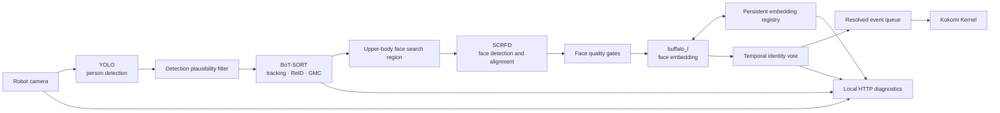
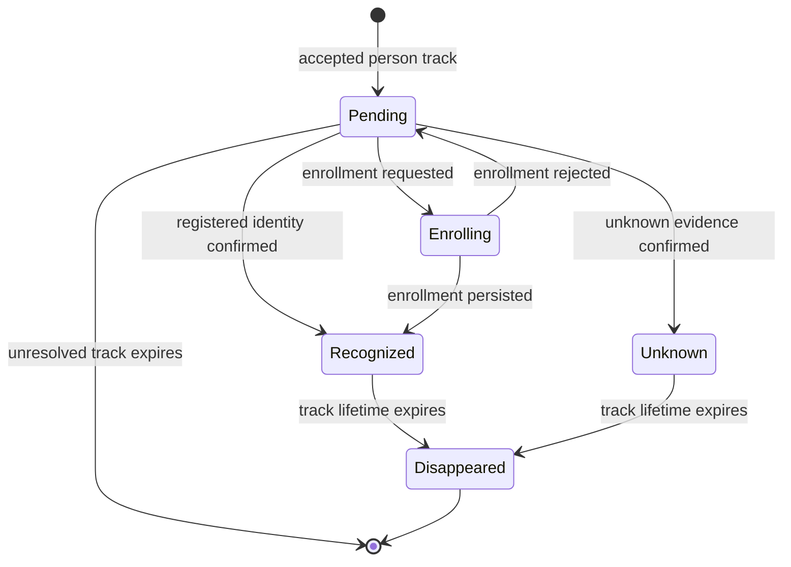

# Embodied Vision


[](https://github.com/taka-k22/embodied-vision/actions/workflows/test.yml?query=branch%3Acodex%2Fdeepsort)


Embodied Vision is the person-perception and identity service for the Waifu 3.0 research platform. It detects people in a robot camera feed, maintains short-lived visual tracks, resolves registered identities, supports multi-view face enrollment, and emits bounded identity events to Kokomi Kernel.

The camera is a conversational sensor. Its output is intended to support dialogue about visible people and scenes, not geometric measurement, ranging, localization, surveillance, or biometric access control.

## System status

| Area | Current state | Operational meaning |
| --- | --- | --- |
| Person detection | Implemented | YOLO detections are filtered by confidence, size, and frame-area ratio |
| Person tracking | Implemented | Ultralytics BoT-SORT maintains track IDs with ReID and camera-motion compensation |
| Face detection and alignment | Implemented | InsightFace SCRFD extracts the most plausible face from each person crop |
| Registered identity matching | Implemented | `buffalo_l` embeddings are matched by cosine distance and temporal voting |
| Face enrollment | Implemented | Multiple consistent, high-quality embeddings are selected and persisted |
| Duplicate identity suppression | Implemented | One registered identity may own at most one active logical track |
| Kernel event delivery | Implemented | Only resolved identity, enrollment, and disappearance events are emitted |
| Raw camera snapshot | Implemented | An unannotated frame is available for Kernel-triggered VLM use |
| Local diagnostics | Implemented | Browser and OpenCV views expose tracking, matching, enrollment, and delivery state |
| General object event contract | Not implemented | The active Kernel protocol is person-identity-only |
| Emotion analysis | Deferred | No FER or affect estimate enters runtime state or Kernel events |

## Architectural model



### Authority boundaries

- YOLO owns frame-local person detections.
- BoT-SORT owns frame-to-frame track IDs; a track ID is not a durable person identity.
- InsightFace owns face detection, alignment, and embedding generation.
- The face registry owns durable `person_id`, name, and reference embeddings.
- Temporal voting owns the transition from `pending` to `recognized` or `unknown`.
- Duplicate suppression owns the one-visible-track-per-registered-identity invariant.
- Embodied Vision owns perception events; Kokomi Kernel owns persistent world state and cognitive consequences.
- The LLM may request enrollment through the Kernel, but it never creates or edits face embeddings directly.

## Runtime composition

| Component | Responsibility |
| --- | --- |
| `deepsort.py` | Runtime composition, camera loop, YOLO inference, BoT-SORT invocation, face worker, event delivery, and HTTP surface |
| `face_registry.py` | InsightFace adapter, quality gates, cosine matching, temporal voting helpers, representative-sample selection, and persistent registry |
| `vision_tracking.py` | Conversion of Ultralytics results and short-occlusion track lifecycle |
| `vision_filters.py` | Implausible person rejection and duplicate identity-track resolution |
| `botsort.yaml` | Accuracy-first BoT-SORT policy with sparse optical-flow GMC and appearance ReID |
| `templates/` and `static/` | Local operational console and annotated MJPEG view |
| `tests/` | Deterministic regression contract for registry, voting, filtering, duplicate suppression, and track lifecycle |
| `archive/` | Historical experiments, superseded dependency manifests, and development-only utilities |

The entry-point name and outbound `source: "deepsort"` value are retained for compatibility. The active tracking implementation is BoT-SORT; no DeepSORT library is used.

## Perception pipeline

### Person detection and tracking

1. YOLO runs in person-only mode.
2. Detections below configured confidence, pixel size, or frame-area thresholds are rejected.
3. BoT-SORT associates accepted detections using motion, detection confidence, appearance features, and sparse optical-flow camera-motion compensation.
4. Logical tracks remain alive for a bounded missing-frame interval to bridge short occlusions.
5. A track that has not reached a resolved identity state produces no Kernel event.

BoT-SORT configuration is loaded from `VISION_TRACKER_CONFIG`. At runtime, `track_high_thresh`, `new_track_thresh`, `track_low_thresh`, and `track_buffer` are overwritten from the corresponding environment policy and written to `data/botsort_runtime.yaml`.

### Face extraction and quality

Only the upper portion of an accepted person box is submitted to the asynchronous face worker. SCRFD chooses the detected face with the strongest confidence-area score. A sample is rejected when any of these gates fail:

- minimum face width or height;
- minimum SCRFD detection confidence;
- Laplacian blur variance;
- grayscale brightness range;
- valid aligned embedding availability.

Accepted samples expose quality metadata for diagnostics but only normalized embeddings enter the registry.

### Identity matching

Each normalized live embedding is compared with every stored exemplar using cosine distance:

```text
distance = 1 - cosine_similarity(live_embedding, stored_embedding)
```

Lower values indicate greater similarity. A candidate is eligible only when its distance does not exceed `FACE_MATCH_THRESHOLD`.

Recognition becomes authoritative by either:

- the same identity matching in two consecutive accepted samples; or
- at least three matching votes in the latest eight samples with a minimum 0.6 vote ratio.

The reported distance is the median of the winning evidence. Once a track is recognized, repeated face analysis stops unless an enrollment session is explicitly started.

### Unknown resolution

`unknown` is a confirmed state, not the absence of a match on one frame. It requires both:

- at least 15 seconds since the first accepted face sample; and
- 40 consecutive high-quality samples without an eligible registered match.

No face, poor-quality face, a transient detector failure, or a short-lived yellow track does not produce `person_unknown`.

### Duplicate identity invariant

A registered `person_id` may own only one active logical track.

- If the existing owner and a new duplicate box are both current, the existing owner is retained and the new track is suppressed.
- If the existing owner is only a stale motion prediction, ownership transfers to the fresh track.
- Ownership transfer does not emit a false disappearance/reappearance pair.
- Suppressed tracks cannot emit recognition or disappearance events.

## Face enrollment contract

Enrollment binds an active `track_id` to a bounded display name. Collection is asynchronous and temporarily owns the identity decision for that track, preventing an `unknown` event from racing enrollment completion.

| Property | Default contract |
| --- | --- |
| Maximum collection time | 30 s |
| Minimum observation time | 8 s |
| Target accepted samples | 8 |
| Minimum representative samples | 4 |
| Representative embeddings selected per enrollment | Up to 8 |
| Stored embeddings per person | Up to 12 |
| Name length | 1–80 characters, excluding control characters |

Samples are clustered by embedding consistency. Isolated outliers and near-duplicate samples are removed, then a quality/diversity score selects representative exemplars. Re-enrolling the same case-insensitive name extends the existing identity instead of creating a second person.

The registry stores embeddings and identity metadata only. Camera frames and face crops remain in memory and are never written by the face registry.

## Kokomi Kernel event contract

Resolved events are sent by HTTP POST to `VISION_EVENT_URL`, whose default is `http://localhost:3000/yolo_event`. The body is one JSON envelope:

```json
{
  "event": {
    "event_id": "9be54ee461174472b781bac112790c2d",
    "source": "deepsort",
    "type": "person_recognized",
    "track_id": "14",
    "timestamp": "2026-09-09T06:20:18.123456+00:00",
    "identity": {
      "status": "recognized",
      "person_id": "26b7e2c15a1e4449974367f7da686b74",
      "name": "KOT",
      "distance": 0.2563,
      "threshold": 0.55
    },
    "message": "The visible registered person is KOT."
  }
}
```

### Common fields

| Field | Contract |
| --- | --- |
| `event_id` | Unique lowercase hexadecimal event identifier; unchanged across delivery retries |
| `source` | Always `deepsort` for Kernel compatibility |
| `type` | One of the four resolved event types below |
| `track_id` | String representation of the current visual track |
| `timestamp` | UTC ISO 8601 observation timestamp |
| `identity.status` | `recognized` or `unknown` for emitted identity events; the last resolved value on disappearance |
| `identity.person_id` | Durable registry ID for recognized identities; otherwise `null` |
| `identity.name` | Registered display name for recognized identities; otherwise `null` |
| `identity.distance` | Cosine distance for a recognition; `0.0` immediately after enrollment; otherwise `null` |
| `identity.threshold` | Configured acceptance boundary |
| `position` | Optional `left`, `center`, or `right`; currently attached to disappearance when known |
| `message` | Stable English summary intended for downstream interpretation |

### Event types

| Type | Emission condition | Suppression rule |
| --- | --- | --- |
| `person_recognized` | Temporal matching resolves a registered identity | Emitted once per logical visible identity episode |
| `person_unknown` | Time and consecutive mismatch requirements both resolve | Suppressed during enrollment and for unusable faces |
| `person_enrolled` | A multi-sample enrollment is persisted successfully | Becomes the identity announcement for that visible track |
| `person_disappeared` | A previously announced resolved track exceeds its missing-frame lifetime | Never emitted for an unannounced pending track or a suppressed duplicate |

`person_appeared` is intentionally not emitted. Detection alone is too unstable to be a cognitive event.

### Event lifecycle



### Delivery semantics

- Events enter a bounded asynchronous queue of 100 items.
- Delivery attempts use delays of 0, 0.2, 0.5, and 1.0 seconds.
- Every retry retains the same `event_id` so the Kernel can deduplicate safely.
- A full queue drops the newly generated event instead of blocking the perception loop.
- Disabling face events immediately drains queued events.
- Re-enabling delivery does not replay events generated while disabled.
- Event delivery state does not stop camera capture, YOLO, tracking, matching, enrollment, snapshots, or the diagnostic UI.

## Local HTTP surface

The default listener is `127.0.0.1:5000`.

| Method | Route | Response contract |
| --- | --- | --- |
| GET | `/` | Local operational console |
| GET | `/status` | Camera, event queue, face worker, execution-provider, quality, enrollment, and stream state; `503` when no camera frame exists |
| GET | `/face-events` | Current requested and effective event-delivery state |
| POST | `/face-events` | Exact JSON body `{ "enabled": boolean }`; disabling also drains queued events |
| GET | `/snapshot` | Latest unannotated camera frame as JPEG; `503` when unavailable |
| GET | `/snapshot/annotated` | Latest tracking/identity overlay as JPEG; `503` when unavailable |
| GET | `/stream/annotated` | No-cache multipart MJPEG diagnostic stream |
| GET | `/tracks` | Active tracks, identity state, face quality/rejection, nearest candidate, evidence count, and enrollment state |
| GET | `/faces` | Registered identity metadata and embedding counts; raw embeddings are omitted |
| POST | `/faces/enroll` | Exact JSON body containing `track_id` and `name`; returns `202` when collection starts |

The HTTP surface has no authentication layer. Loopback binding is therefore the default security boundary.

## Identity and track states

The diagnostics API may report four identity states:

| State | Meaning |
| --- | --- |
| `pending` | A live track exists but identity evidence is not yet authoritative |
| `recognized` | A registered identity has passed temporal confirmation or enrollment |
| `unknown` | Sustained high-quality mismatch evidence has passed the unknown policy |
| `unavailable` | Face recognition is disabled or its worker failed |

Track IDs are process-local and disposable. `person_id` is the durable identity key.

## Persistence and privacy

The default registry is `data/face_registry_buffalo_l.json`.

```json
{
  "version": 1,
  "model": "buffalo_l",
  "distance_metric": "cosine",
  "people": [
    {
      "person_id": "<uuid>",
      "name": "KOT",
      "created_at": "<ISO-8601>",
      "updated_at": "<ISO-8601>",
      "embeddings": [["<normalized floating-point vector>"]]
    }
  ]
}
```

- Writes use a temporary file followed by replacement.
- Registry model names must match the configured embedding model.
- Embeddings from SFace, Facenet512, and `buffalo_l` are not interchangeable and are not migrated automatically.
- Registry files, temporary files, and generated BoT-SORT runtime configuration are excluded from source control.
- Biometric embeddings remain sensitive personal data even though source images are not stored.
- InsightFace pretrained model licensing must be evaluated separately for any use beyond non-commercial research.

## Configuration contract

### Service and delivery

| Variable | Default | Meaning |
| --- | --- | --- |
| `VISION_EVENT_SEND_ENABLED` | `true` | Process-wide master event-delivery policy |
| `FACE_EVENT_SEND_ENABLED` | `true` | Initial runtime face-event switch state |
| `VISION_EVENT_URL` | `http://localhost:3000/yolo_event` | Kokomi Kernel event endpoint |
| `VISION_EVENT_REQUEST_TIMEOUT_SECONDS` | `10.0` | Timeout for one HTTP delivery attempt |
| `VISION_HTTP_HOST` | `127.0.0.1` | Local HTTP bind address |
| `VISION_HTTP_PORT` | `5000` | Local HTTP port |
| `VISION_DISPLAY_ENABLED` | `true` | OpenCV diagnostic window policy |
| `VISION_UI_STREAM_FPS` | `30` | MJPEG stream limit, clamped to 1–120 fps |
| `VISION_UI_JPEG_QUALITY` | `90` | MJPEG quality, clamped to 50–100 |

### Detection and tracking

| Variable | Default | Meaning |
| --- | --- | --- |
| `VISION_CAMERA_INDEX` | `0` | OpenCV camera device index |
| `VISION_YOLO_MODEL` | `yolov8n.pt` | YOLO model path |
| `VISION_YOLO_CONFIDENCE` | `0.50` | New-track and high-confidence threshold |
| `VISION_YOLO_TRACK_CONFIDENCE` | `0.10` | Low-confidence association floor |
| `VISION_YOLO_MIN_PERSON_WIDTH` | `40` | Minimum accepted person-box width in pixels |
| `VISION_YOLO_MIN_PERSON_HEIGHT` | `80` | Minimum accepted person-box height in pixels |
| `VISION_YOLO_MIN_PERSON_AREA_RATIO` | `0.002` | Minimum person-box area relative to the frame |
| `VISION_TRACKER_CONFIG` | `botsort.yaml` | Source BoT-SORT policy |
| `TRACK_MAX_AGE` | `90` | Missing-frame lifetime for tracker and event state |

### Face recognition and quality

| Variable | Default | Meaning |
| --- | --- | --- |
| `FACE_RECOGNITION_ENABLED` | `true` | Face worker and identity matching policy |
| `FACE_MODEL_NAME` | `buffalo_l` | InsightFace model pack and registry namespace |
| `FACE_MODEL_ROOT` | InsightFace default | Model storage root |
| `FACE_MATCH_THRESHOLD` | `0.55` for supported buffalo models | Maximum accepted cosine distance |
| `FACE_EXECUTION_PROVIDERS` | `CUDAExecutionProvider,CPUExecutionProvider` | Requested ONNX Runtime provider priority |
| `FACE_REQUIRE_GPU` | `true` | Reject silent CPU fallback when no accelerator owns the sessions |
| `FACE_ANALYSIS_INTERVAL_SECONDS` | `0.25` | Minimum face-analysis interval per track |
| `FACE_MIN_PERSON_WIDTH` | `100` | Minimum person crop width submitted to the face worker |
| `FACE_MIN_PERSON_HEIGHT` | `140` | Minimum person crop height submitted to the face worker |
| `FACE_PERSON_CROP_TOP_RATIO` | `0.75` | Top fraction of the person box searched for faces |
| `FACE_INPUT_MAX_DIMENSION` | `640` | Maximum submitted crop edge |
| `FACE_DETECTION_SIZE` | `640` | SCRFD square detection input |
| `FACE_MIN_FACE_SIZE` | `70` | Minimum accepted face width and height |
| `FACE_MIN_DETECTION_CONFIDENCE` | `0.70` | Minimum SCRFD confidence |
| `FACE_MIN_BLUR_VARIANCE` | `35.0` | Minimum Laplacian sharpness variance |
| `FACE_MIN_BRIGHTNESS` | `35.0` | Minimum mean grayscale brightness |
| `FACE_MAX_BRIGHTNESS` | `225.0` | Maximum mean grayscale brightness |

### Temporal identity and enrollment

| Variable | Default | Meaning |
| --- | --- | --- |
| `FACE_CONFIRMATIONS` | `3` | Minimum winning votes in the normal recognition path |
| `FACE_RECOGNITION_WINDOW` | `8` | Recent sample window used for voting |
| `FACE_RECOGNITION_MIN_VOTE_RATIO` | `0.6` | Minimum winner share of the vote window |
| `FACE_CONSECUTIVE_CONFIRMATIONS` | `2` | Consecutive identical matches required for fast recognition |
| `FACE_UNKNOWN_CONFIRMATIONS` | `40` | Consecutive accepted mismatches required for `unknown` |
| `FACE_UNKNOWN_MIN_SECONDS` | `15.0` | Minimum unknown-observation duration |
| `FACE_OBSERVATION_BUFFER_SIZE` | `64` | Per-track accepted encoding buffer capacity |
| `FACE_ENROLLMENT_SECONDS` | `30.0` | Enrollment deadline |
| `FACE_ENROLLMENT_MIN_SECONDS` | `8.0` | Minimum collection duration before early completion |
| `FACE_ENROLLMENT_MIN_SAMPLES` | `4` | Minimum representative samples required to persist |
| `FACE_ENROLLMENT_TARGET_SAMPLES` | `8` | Accepted-sample target for early completion |
| `FACE_ENROLLMENT_EXEMPLARS` | `8` | Maximum representatives selected per enrollment |
| `FACE_ENROLLMENT_CLUSTER_DISTANCE` | Derived, normally `0.65` | Maximum distance joining samples into a consistency cluster |
| `FACE_MAX_EMBEDDINGS_PER_PERSON` | `12` | Maximum stored exemplars per durable identity |
| `FACE_REGISTRY_PATH` | `data/face_registry_<model>.json` | Persistent registry path |

## Operational observability

The local console exposes:

- raw and annotated camera readiness;
- requested and actual ONNX Runtime execution providers;
- explicit worker failure when CUDA/TensorRT was requested but sessions fell back to CPU;
- active track IDs and identity states;
- current and best registered candidate with distance and threshold;
- accepted evidence count and most recent quality or rejection reason;
- enrollment sample count, deadline, and terminal result;
- registered identities and stored exemplar counts;
- current event-delivery state and queue depth.

The OpenCV overlay uses green for recognized tracks and yellow for pending or unknown tracks. The `E` key changes the runtime event-delivery switch; Escape terminates the camera loop.

## Safety invariants

1. A raw person detection never emits `person_appeared`.
2. A single failed face match never establishes `unknown`.
3. A registered identity cannot own two active logical tracks.
4. A pending or suppressed track cannot emit `person_disappeared`.
5. Enrollment requires a currently active visual track and bounded name.
6. Enrollment persists only a consistent cluster of multiple usable samples.
7. No source image or face crop is written to the registry.
8. Disabled event delivery cannot accumulate a backlog for later replay.
9. Failed Kernel delivery cannot block the camera inference loop indefinitely.
10. Requested GPU execution cannot silently become CPU execution when `FACE_REQUIRE_GPU` is enabled.

## Verification contract

The regression suite currently contains 15 passing tests covering:

- registry enrollment, matching, reload, bounded exemplars, and duplicate removal;
- representative-sample clustering and outlier rejection;
- temporal voting, occasional failed samples, split-identity rejection, and fast consecutive recognition;
- implausible person-box filtering;
- duplicate identity ownership and stale-track transfer;
- short-occlusion track lifecycle;
- conversion of Ultralytics tracking results into plain observations.

GitHub Actions runs Ruff linting, the regression suite, Python compilation, and dashboard JavaScript syntax validation on Windows and Ubuntu with Python 3.11. CI runs on pull requests, pushes to `main` or `codex/**`, and manual dispatch. Concurrent superseded runs are cancelled, and workflow permissions are read-only.

The suite is deterministic and does not require a camera, model download, or GPU. Hardware-in-the-loop, real-video regression, Kernel contract testing, and Jetson performance gates are not automated.

## License

The repository source is licensed under the [MIT License](LICENSE). Third-party models and datasets retain their own terms.
